# Al Fatih Zainul Falah (Kirin)

## 🛠️ Tech Stack

<!-- STACK START -->
[] [] [] [] [] [] []
<!-- STACK END -->
 
<picture>
  <source media="(prefers-color-scheme: dark)" srcset="./dist/contribution-crawl-dark.svg">
  <source media="(prefers-color-scheme: light)" srcset="./dist/contribution-crawl-light.svg">
  
</picture>

<!-- REPOS START -->
## 📚 My Repositories

| Repository | Repository | Repository | Repository | Repository |
| --- | --- | --- | --- | --- |
| **[alfatih-piagam](https://github.com/alfatih-piagam/alfatih-piagam)** My Profile | **[wh-app](https://github.com/alfatih-piagam/wh-app)** | **[sym-math](https://github.com/alfatih-piagam/sym-math)** | **[pwa](https://github.com/alfatih-piagam/pwa)** | **[pilargroup](https://github.com/pilargroup-id/pilargroup)** |
| **[jwt-test](https://github.com/alfatih-piagam/jwt-test)** | **[template-frontend-pilargroup](https://github.com/alfatih-piagam/template-frontend-pilargroup)** | **[invoice](https://github.com/alfatih-piagam/invoice)** | **[request-sh](https://github.com/alfatih-piagam/request-sh)** | **[ticket](https://github.com/pilargroup-id/ticket)** |
| **[papertrail](https://github.com/pilargroup-id/papertrail)** | **[framelens](https://github.com/pilargroup-id/framelens)** | **[form-lembur](https://github.com/pilargroup-id/form-lembur)** | **[billforge](https://github.com/pilargroup-id/billforge)** | **[treeview](https://github.com/pilargroup-id/treeview)** |
| **[touchpoint](https://github.com/pilargroup-id/touchpoint)** 🍴 1 | **[ticketing-legal](https://github.com/alfatih-piagam/ticketing-legal)** ⭐ 1 | **[document-generator-pnm](https://github.com/manusiasilver/document-generator-pnm)** Automasi Generate DOC number | **[sales-activity](https://github.com/alfatih-piagam/sales-activity)** | **[ticketing](https://github.com/alfatih-piagam/ticketing)** |

<!-- REPOS END -->

<!-- MARKDOWN LINKS & IMAGES -->
[contributors-shield]: https://img.shields.io/github/contributors/MaskiCoding/Contribution-Crawl.svg?style=for-the-badge
[contributors-url]: https://github.com/MaskiCoding/Contribution-Crawl/graphs/contributors
[forks-shield]: https://img.shields.io/github/forks/MaskiCoding/Contribution-Crawl.svg?style=for-the-badge
[forks-url]: https://github.com/MaskiCoding/Contribution-Crawl/network/members
[stars-shield]: https://img.shields.io/github/stars/MaskiCoding/Contribution-Crawl.svg?style=for-the-badge
[stars-url]: https://github.com/MaskiCoding/Contribution-Crawl/stargazers
